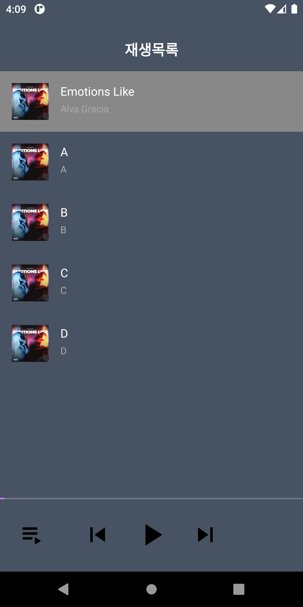
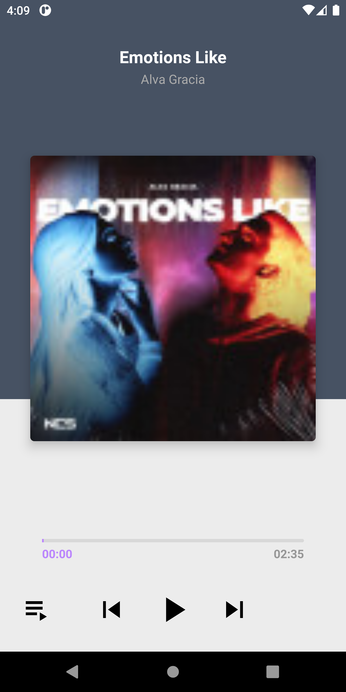

# Android Clone Coding Project #17 멜론
Retrofit 을 이용하여 재생 목록을 받아와 구성함
 
재생 목록을 클릭하여 ExoPlayer 를 이용하여 음악을 재생할 수 있음.
 
이전, 다음 트랙 버튼을 눌러서 이전, 다음 음악으로 재생하고, ui 를 업데이트 할 수 있음.
 
PlayList 화면과 Player 화면 간의 전환을 할 수 있음.
 
Seekbar 를 custom 하여 원하는 UI 로 표시할 수 있음.
 

# 결과화면
|Screenshot1|Screenshot2|
|---|---|
|||
|||

 

# 배운 내용 정리
- **Exoplayer**
  - custom controller
  - Playlist 등
- androidx.constraintlayout.widget.Group
- **Seekbar** Custom 하기

### ExoPlayer

- Google이 Android SDK 와 별도로 배포되는 오픈소스 프로젝트
- 오디오 및 동영상 재생 가능
- 오디오 및 동영상 재생 관련 강력한 기능들 포함
- 유튜브 앱에서 사용하는 라이브러리
- https://exoplayer.dev/hello-world.html
